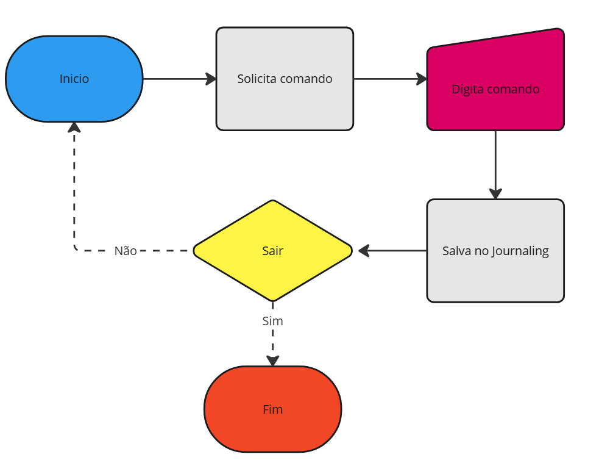
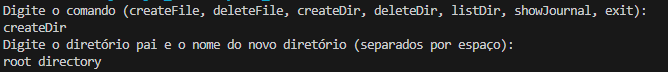
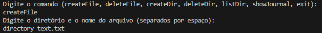
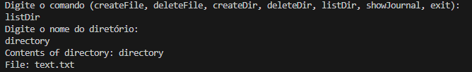
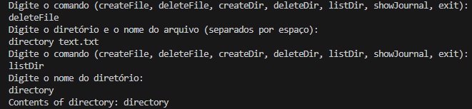
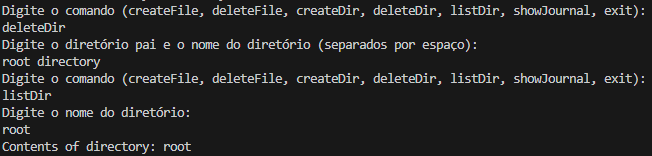
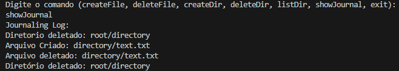

# Simulador de Sistema de Arquivos
## **Equipe:**
- Maria Iana da Silva Araujo
- Matheus Alves Oliveira

Este projeto consiste em um simulador de sistema de arquivos desenvolvido em Java. Ele implementa funcionalidades básicas de manipulação de arquivos e diretórios, com suporte a Journaling para garantir a integridade das operações realizadas. O objetivo é oferecer uma compreensão prática do funcionamento de sistemas de arquivos, especialmente os dotados de journaling.

---

## **Introdução ao Sistema de Arquivos com Journaling**

Um sistema de arquivos é um sistema lógico utilizado por sistemas operacionais para organizar e gerenciar arquivos em dispositivos de armazenamento. Ele define como os dados são armazenados, acessados e organizados. Alguns dos sistemas de arquivos mais conhecidos incluem FAT, NTFS, APFS, HFS, EXT4, entre outros.

### **Journaling**
Journaling é um mecanismo que registra alterações feitas no sistema de arquivos em logs. Esse processo garante a integridade dos dados em caso de falhas ou interrupções inesperadas, permitindo a recuperação do estado anterior.

---

## **Arquitetura do Simulador**

### **Componentes do Simulador**

1. **`FileSystemSimulator`**: Classe core do simulador que gerencia os comandos principais do sistema de arquivos com suas respectivas funções de manipulação de arquivos.

2. **`Directory`**: Representa a estrutura de diretórios no sistema de arquivos. Sua lógica permite que um diretório possa conter outros diretórios e arquivos, nada mais é do que a criação de um arquivo especial que representa a lógica estrutural de um diretório. Ele utiliza duas listas internas para gerenciar seus conteúdos. 

3. **`FileEntry`**: A classe representa a lógica de um arquivo em um sistema de arquivos, neste caso optei pelo arquivo não poder ser escrito seu conteúdo, apenas o nome para simulação. 

4. **`Journal`**: Classe que implementa o método de journaling, que foi previamente descrito. Neste código, registra as operações realizadas no simulador de  sistema de arquivo e retorna as atividades quando o mesmo é solicitado.

---

## **Fluxograma**

Fluxo básico de operações no simulador:

## **Implementação em Java**
	Segue abaixo representações retiradas na execução de cada comando da simulação do sistema de arquivos. 

Criar diretório

Criar arquivo: 

Listar conteúdo de um arquivo: 

Deletar Arquivo: 

Deletar Diretório:

Mostrar Journaling: 

## **Referências Bibliográficas**
Entendendo os sistemas de arquivos. Disponível em: <https://www.kingston.com/br/blog/personal-storage/understanding-file-systems>.
Acesso em: 2 dez. 2024.

O que é : Journaling vs. Non-Journaling File Systems. Disponível em: <https://napoleon.com.br/glossario/o-que-e-journaling-vs-non-journaling-file-systems/>. Acesso em: 2 dez. 2024.
